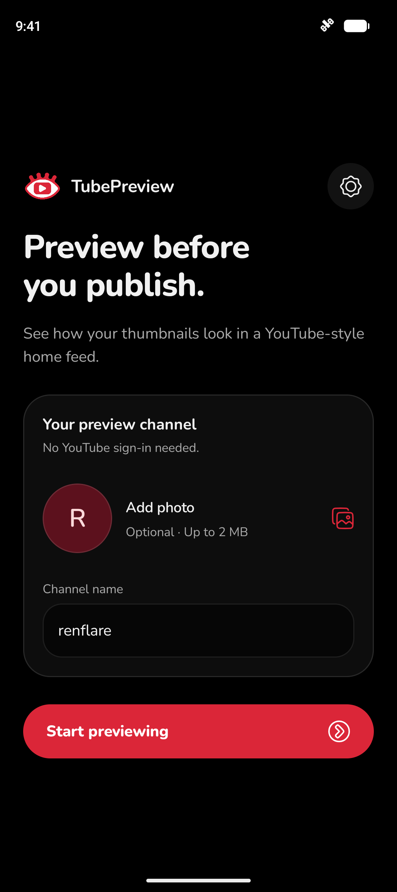

  

# TubePreview

**Preview before you publish.**

See how your thumbnails, titles, and channel branding look in a YouTube-style
home feed on Android. No YouTube account required.

[**Download TubePreview 1.0 for Android →**](https://github.com/notrenflare/TubePreview-releases/releases/download/v1.0/TubePreview-1.0.apk)

Android 7.0 or newer · [Release notes](https://github.com/notrenflare/TubePreview-releases/releases/latest)

## Features

- Preview a thumbnail alongside sample videos and adjust its feed placement.
- Customize your channel photo, name, video title, views, and duration.
- Switch between light mode and a pure-black dark theme, including during setup.

TubePreview is an independent tool and is not affiliated with YouTube or Google.
It does not upload videos or modify your YouTube channel.

## Screenshots

  
  
  
  

## Install

1. [Download the APK](https://github.com/notrenflare/TubePreview-releases/releases/download/v1.0/TubePreview-1.0.apk) and open it.
2. If Android asks, allow installation from the browser or file manager you used.
3. Install TubePreview. You can turn that installation permission off afterward.

Some devices currently show a Play Protect warning for this new developer. Do not
disable Play Protect to install the app.

Install updates over the existing app to keep your settings and imported images.
The [release page](https://github.com/notrenflare/TubePreview-releases/releases/latest)
includes the APK checksum and signing certificate fingerprint.

## Privacy

Your imported images and preview settings stay in private app storage.
There is no sign-in or backend service, and imported images are not uploaded.
Sample feed photos load from Unsplash over HTTPS. App data is excluded from
Android backup and device transfer. Uninstalling removes your local app data.

## Feedback

Use [Issues](https://github.com/notrenflare/TubePreview-releases/issues) for bug
reports and feature requests. Remove private content from screenshots and logs.

This repository hosts downloads and release documentation. The application source
is maintained privately.

Icons: [Streamline](https://streamlinehq.com) and [Material Icons](https://fonts.google.com/icons).
Setup typography: [Nunito](https://fonts.google.com/specimen/Nunito).
See [third-party notices](THIRD_PARTY_NOTICES.md) for asset licenses.

Made with ❤️ by [**renflare**](https://github.com/notrenflare).
