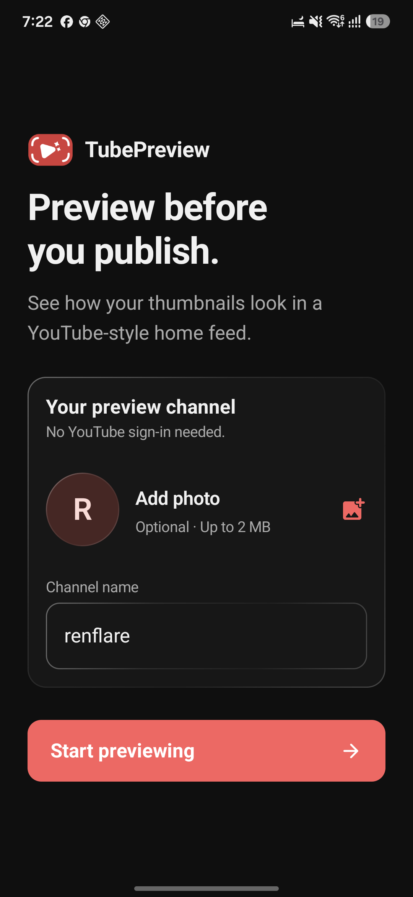
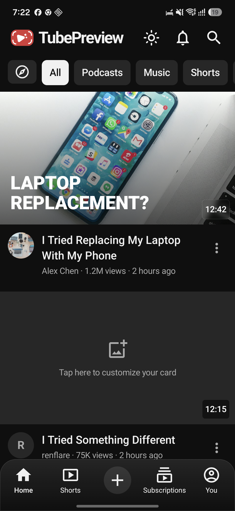
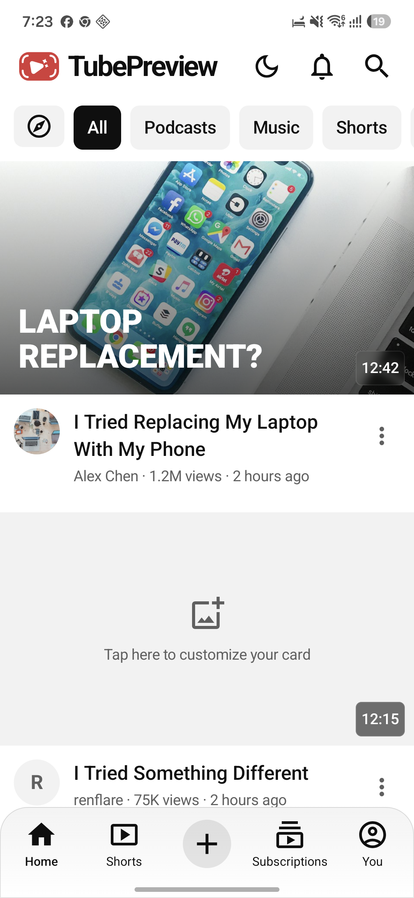
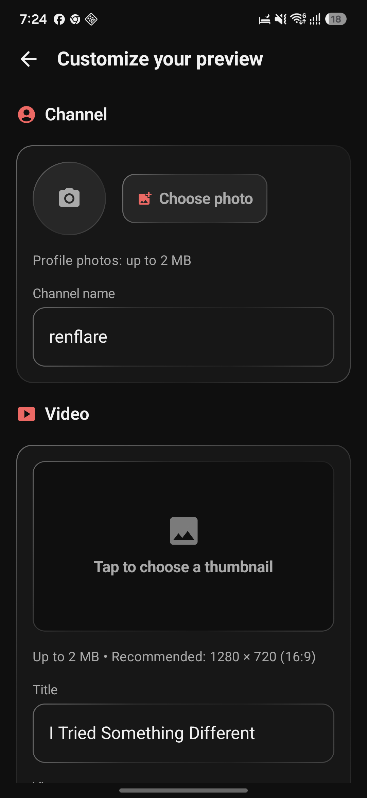

  

# TubePreview

**Preview before you publish.**

See how your thumbnails, titles, and channel branding look in a YouTube-style
home feed on Android. No YouTube account required.

[**Download the latest APK →**](https://github.com/notrenflare/TubePreview-releases/releases/latest)

Requires Android 7.0 or newer.

## Features

- Preview a thumbnail alongside sample videos and adjust its feed placement.
- Customize your channel photo, name, video title, views, and duration.
- Compare your preview in light and dark themes.

TubePreview is an independent tool and is not affiliated with YouTube or Google.
It does not upload videos or modify your YouTube channel.

## Screenshots

<table>
  <tr><th>Get started</th><th>Dark feed</th><th>Light feed</th><th>Customize</th></tr>
  <tr>
    <td></td>
    <td></td>
    <td></td>
    <td></td>
  </tr>
</table>

## Install

1. Open the [latest release](https://github.com/notrenflare/TubePreview-releases/releases/latest).
2. Download `TubePreview-1.0.apk` under **Assets**, then open the file.
3. If Android asks, allow installation from the browser or file manager you used.
4. Install TubePreview. You can turn that installation permission off afterward.

Install newer releases over the existing app to keep your settings. If you
previously installed a development build, Android may require you to uninstall it
first because it uses a different signing key. Uninstalling removes local app data.

Each release includes a SHA-256 checksum for verifying the downloaded APK.

## Privacy

Your imported images and preview settings stay in private app storage.
There is no sign-in or backend service, and imported images are not uploaded.
Sample feed photos load from Unsplash over HTTPS. App data is excluded from
Android backup and device transfer.

## Feedback

Use [Issues](https://github.com/notrenflare/TubePreview-releases/issues) for bug
reports and feature requests. Remove private content from screenshots and logs.

This repository hosts downloads and release documentation. The application source
is maintained privately.

Made with ❤️ by [**renflare**](https://github.com/notrenflare).
