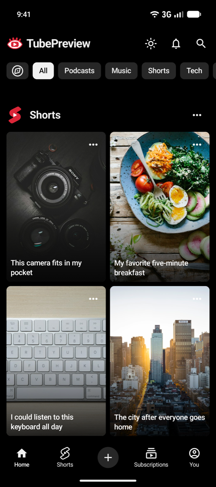

  

# TubePreview

**Preview before you publish.**

I built TubePreview to check how a thumbnail looks in a YouTube-style feed before
publishing. Add your image, try a title, and see it alongside sample videos.
No YouTube sign-in needed.

[**Download TubePreview 1.0 for Android →**](https://github.com/notrenflare/TubePreview-releases/releases/download/v1.0/TubePreview-1.0.apk)

Android 7.0 or newer · [Release notes](https://github.com/notrenflare/TubePreview-releases/releases/latest)

## Features

- See your thumbnail alongside sample videos and choose where it appears.
- Try different titles, channel photos, names, view counts, and durations.
- Compare your preview in light mode and a pure-black dark theme.

TubePreview is an independent preview tool. It isn't affiliated with YouTube or
Google, and it doesn't upload videos or change your channel.

## Screenshots

  
  
  

  
  

## Install

1. [Download the APK](https://github.com/notrenflare/TubePreview-releases/releases/download/v1.0/TubePreview-1.0.apk) and open it.
2. If Android asks, allow installation from the browser or file manager you used.
3. Install TubePreview. You can turn that installation permission off afterward.

When an update is available, install it over the existing app to keep your settings
and imported images. [Release files and scan results](SECURITY.md#release-checks)
are available if you'd like to check the download.

## Privacy

Your thumbnails, channel photo, and preview settings stay on your device;
TubePreview doesn't upload them. Sample feed photos load from Unsplash over HTTPS.
App data isn't included in Android backup or device transfer. Uninstalling the app
removes your saved previews.

## Feedback

If you spot a bug or have an idea, [let me know](https://github.com/notrenflare/TubePreview-releases/issues/new/choose).
Screenshots are welcome; please remove personal information before posting them.

This repo is for downloads and feedback. The app's source code is private.
Asset credits and licenses are in [third-party notices](THIRD_PARTY_NOTICES.md).

Made with ❤️ by [**renflare**](https://github.com/notrenflare).
